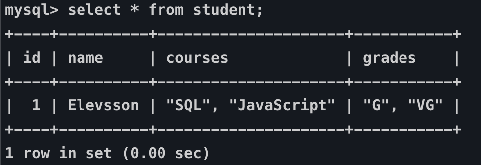

#### POWERPOINTS

**1**

```
Relational Database Design Theory

- Hur vi planerar för att designa vår databas
	- Hur?
	- Varför?
```

**2**

```
Vad vi kommer att gå igenom

- Entities och dess Attributes
- Basic Data Relationships
- Data Integrity
- Database Anomalies
- Normalization

- Övningsuppgift!
```

**3**

```
Entities och deras Attributes

I Databas Design brukar man börja med att identifiera entities. En entity är något som vi lagrar data för. 

- Student är en entity
- Course är en entity 
- Lesson är en entity.

En entity har data som beskriver dem; attributes. 
```

**4**

**entity.png**


```
Här har vi ett exempel på en entity, och dess relaterade attribut.

student är entity och firstName, lastName och age är dess attribut
```

##### 5. 

```
Övningsexempel

Fundera över ett databas-system som du som student ska vara en del av.

Vilken information behöver skolan ha om dig?

- Program
- kurser
- betyg
- adress
- ...
```

Här kan skapa en bred table med all information antingen på papper eller excel

id firstName lastName age program program_name program_location courses grades etc

Senare när du har gått igenom normal forms kan man ta och arbeta med denna datan och bryta ned det till en god design.

**6**

```
Vilken information kom ni fram till?
```

**7**

```
Hur delar vi upp information?

Låt oss börja med att gå igenom vilka typer av relationer som finns.

- One-to-one
- One-to-Many
- Many-to-Many
```

**8**

**1nf.png**



```
Single-Valued VS Multivalued Attributes

Attributen i vår data model måste vara single-valued. Har ett attribut flera värden, som till exempel flera telefonnummer lagrade i samma attribut, kallar vi det för multivalued attributes. Eftersom att ett attribut inte får inne ha multivalued attributes så behöver vi då skapa en egen entity åt dessa.

Vad är problemet med multivalued attributes? De kan skapa problem med *meaning* av data i en databas, gör sökningar långsamma och skapar onödiga restriktioner för hur mycket data som kan lagras i vår databas.

Försök att se det som en god sak. Har du multivalued attributes så VET du att du måste skapa en ny entity åt dessa.
```

**9**

```
Data Integrity

I stort handlar Data Integrity om att ha korrekt data i ens databas.

- Entity Integrity

Våra entities måste vara unika. Vi säger att vi applicerar Entity Integrity när vi exempelvis använder oss av Primary Key.

- Referential Integrity

Vi säger att vi applicerar Referential Integrity när vi exempelvis använder oss av Foreign Key

- Domain Integrity

Acceptabla värden för en kolumn. Vi säger att vi applicerar Domain Integrity när vi exempelvis använder oss av check.
```

**10**

```
Database Anomalies

Database Anomalies sker vid dåligt planerad databas-design. En teknik för att undgå database anomalies, och ha en väl planerad databas-design kallas för Normalization som vi snart kommer att komma in på. 

Det finns tre typer av database anomalies:
```

**11**

```
Insert Anomalies

Detta sker när vi inte kan sätta in ett attribut utan närvaron av ett annat attribut.

Läraren har anställts av skolan, men ännu inte fått någon kurs att lära ut.

CREATE TABLE teacher (
     id MEDIUMINT NOT NULL AUTO_INCREMENT,
     name CHAR(30) NOT NULL,
     course VARCHAR(50) NOT NULL,
     PRIMARY KEY (id)
);

INSERT INTO teacher(name) VALUES('Teachy-Teach');

För att undvika problem behöver vi dela upp **teacher** och **course** tables.
```

**12**

Fokus ligger på adressen till studenten som finns på två olika ställen.

```
Update Anomalies

Om vi har information om samma data i två olika tables, och uppdaterar informationen i en table så att datan blir inkonsekvent.

CREATE TABLE student (
  id MEDIUMINT NOT NULL AUTO_INCREMENT,
  name VARCHAR(255),
  address VARCHAR(255),
  PRIMARY KEY (id)
);

CREATE TABLE grade (
  id MEDIUMINT NOT NULL AUTO_INCREMENT,
  grade CHAR(30),
  student_id MEDIUMINT,
  student_address VARCHAR(255),
  sent_grade BOOL,
  PRIMARY KEY (id),
  FOREIGN KEY(student_id) REFERENCES student(id)
);
```

**13**

```
Deletion Anomaly

När data raderas på grund av radering av någon annan data. 
```

**14**

```
Database Normalization är processen i att strukturera en databas. Denna process går igenom en serie av **Normal Forms** och syftet är att reducera **data redundency** och samtidigt stärka **data integrity**.

Med **data redundency** menas, när det kommer till databaser, att vi vill undvika att samma data finns på flera olika ställen. Data redundency kommer med största sannolikhet att leda till **data anomalies** och **korruption**.

**Data integrity** betyder i sammanhanget säkerställandet av att datan är korrekt och konsistent genom hela dess livscykel.
```

**15**

```
Normal Forms

Varje Normal Forms representerar en ökad grad av förbättrad databas design. Ju högre nivå, ju bättre design. I de flesta fall räcker det med att implementera de 3 första, men totalt finns det 6 Normal Forms vilka vi kommer att gå igenom steg för steg utifrån ett exempel.
```

**16**

```
En table är i first normal form om den möter följande kriterier:

- The data are stored in a two-dimensional table.

- There are no repeating groups.
```

**17**

```
Repeating Groups

En repeterad grupp (Repeating Groups) är ett attribut som har fler än ett värde i varje row av en table
```

**18**

**1nf.png**


```
Här ser vi ett tydligt exempel på repeating groups: Courses och grades. Det skapar två stora problem:

1. Vi kan inte veta med 100% säkerhet vilket betyg korrespondar med vilken kurs. Vi skulle kunna utgå ifrån att det är i samma position som courses, men vad säger att den relativa positionen alltid kommer att förbli densamma?
2. Att söka igenom table:n är väldigt svårt. Skulle vi söka efter betyg för kurser i JavaScript som gavs före 2005 behöver vi utföra komplicerade queries.
```

**19**

```
Lösningen är simpel. Vi undviker helt enkelt repeterade grupper.

Tillvägagångsättet är att skapa ytterligare en table där vi lagrad de anställdas barn. 
```


**20**

```
Second Normal Form

Även om vi har lyckats ta oss ifrån 1NF och åtminstone undviktit repeterade grupper, så är vi, previs som vi gick igenom med våra insert och deletion- anomalies, långt ifrån färdiga med vår design.

Lösningen är att bryta ned relationen så vi tillslut har en relation för varje enity. 

Second Nomal Forms definieras som:

- The relation is in first normal form
- All non-key attributes are functionally dependent on the entire primary key
```

**24**

```
Functional Dependencies

Functional Dependency är en *one-way* relationship mellan två attribut. Vid varje given tidpunkt, för varje unikt värde av attribut A är endast ett värde av attribut B associerat med det i deras relation.
```

**25**

```
fort. Functional Dependencies

relation orders

attribut A = cust_num

cust_num --> first, last, street, city, state, zip, phone

Läses som: Customer Number bestämmer first, last, street... I denna relation är cust_num determinant, ett attribut som bestämmer värdet av andra attribut. 

first, last, street, city, state, zip, phone är alla **functionally dependent** av **cust_num**

Även om deras värden kan ändras så handlar det fortfarande bara om ett attribut
```

**26**

```
first, last, street, city, state, zip, phone är alla **functionally dependent** av **cust_num**

Även om deras värden kan ändras så handlar det fortfarande bara om ett attribut

Vilka andra functional dependencies har vi?

item num --> title, price

order_num --> cust_num, order_date

item_num + order_num --> has_shipped
```

**27**

```
Att använda Functional Dependencies för att nå 2NF

Vi kan använda denna information till att skapa Second Normal Forms relationer. Varje **determant** blir **primary key** av en relation. Varje attribut som är functionally dependant av denna blir non-key attributes i deras relation.

customer(cust_num, first, last, street, city, state, zip, phone)

item(item_num, title, price)

order (order_num, cust_num, order_date)

order_items (order_num AND item_num, has_shipped)
```

**28**

```
3NF definition är:

- The relation is in second normal form
- There are no transitive dependencies
```

**29**

```
Transitive Dependencies

Transitive Dependency pattern existerar när man har följande functional dependency pattern:


A --> B och B --> C 

Så säg att vi säljer en bok, som dsitribueras av ett lager och vi lagrara ett telefonnummer till detta lager

item(item_num, title, price, dist_num, warehouse_phone_number)
```

**30**

```
Ända anledningen till varför **warehouse_phone_number** är functionally dependent av item_num är tack vare att **dist_num** är functionaly dependent av item_num

item_num --> dist_num
dist_num --> warehouse_phone_number
```

**31**

```
Skapa en databas design baserat på vad vi har gått igenom.

Fundera över ett databas-system som du som student ska vara en del av.

Vilken information behöver skolan ha om dig?

- Program

- kurser

- betyg

- adress

osv.

Skapa en table där all information lagras.

Gå därefter igenom samtliga Normal Forms och skapa dig en bra Databas Design!
```

