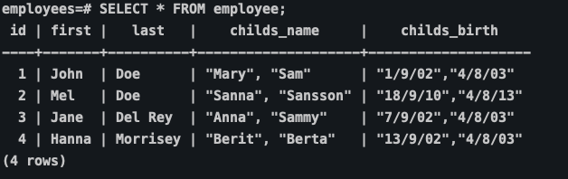
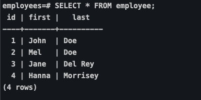
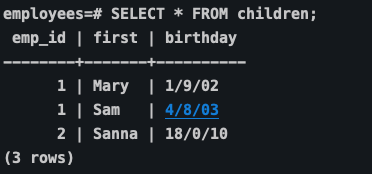

## Relational Database Design Theory

##### Entities och deras Attributes

I Databas Design brukar man börja med att identifiera **entities**. En entity är något som vi lagrar data för. 

- **User** är en entity
- **Customer** är en entity 
- **Concert** är en entity.

En entity har data som beskriver dem; **attributes**. 

När vi representerar entities i en databas är det vanligt att endast lagra dess attributes.

###### Entity Identifiers

Ända anledningen till varför vi vill lagra data som beskriver en entity i en databas är att vi någon gång vill hämta datan. Vi behöver därför ett sätt att särskilja en entity från en annan.

###### Single-Valued Versus Multivalued Attributes

Attributen i vår data model måste vara **single-valued**. varje instance av entity kan bara ha ett värde. Har ett attribut flera värden, som till exempel flera telefonnummer lagrade i samma attribut, kallar vi det för **multivalued attributes**. Eftersom att ett attribut inte får inne ha multivalued attributes så behöver vi då skapa en egen entity åt dessa.

Vad är problemet med multivalued attributes? De kan skapa problem med *meaning* av data i en databas, gör sökningar långsamma och skapar onödiga restriktioner för hur mycket data som kan lagras i vår databas.

Försök att se det som en god sak. Har du multivalued attributes så VET du att du måste skapa en ny entity åt dessa.

###### Basic Data Relationships

Vi bestämmer själva, eller försöker att se, relationen entities emellan. Det finns tre basic typer av relationer; one-to-one, one-to-many och many-to-many. Vi kollar efter relationerna som instanserna av entities har. En **customer** relateras till de varor han eller hon beställer, och var alltså därför ett one-to-many.

#### Database Normalization

Database Normalization är processen i att strukturera en databas. Denna process går igenom en serie av **Normal Forms** och syftet är att reducera **data redundency** och samtidigt stärka **data integrity**.

Med **data redundency** menas, när det kommer till databaser, att vi vill undvika att samma data finns på flera olika ställen. Data redundency kommer med största sannolikhet att leda till **data anomalies** och **korruption**.

**Data integrity** betyder i sammanhanget säkerställandet av att datan är korrekt och konsistent genom hela dess livscykel.

#### Normal Forms

Varje Normal Forms representerar en ökad grad av förbättrad databas design. Ju högre nivå, ju bättre design. I de flesta fall räcker det med att implementera de 3 första, men totalt finns det 6 Normal Forms vilka vi kommer att gå igenom steg för steg utifrån ett exempel.

#### First Normal Form (1NF)

En table är i first normal form om den möter följande kriterier:

- The data are stored in a two-dimensional table.

- There are no repeating groups.

###### Repeating Groups

En **repeterad grupp** (Repeating Groups) är ett attribut som har fler än ett värde i varje row av en table




Här ser vi ett tydligt exempel på repeating groups. Både *childs_name* och *childs_birth* kulumnerna har flera värden i sig. Det skapar två stora problem:

1. Vi kan inte veta med 100% säkerhet vilken födelsedag som innehas av ett barn. Vi skulle kunna utgå ifrån att det är i samma position som childs_name, men vad säger att den relativa positionen alltid kommer att förbli densamma?
2. Att söka igenom table:n är väldigt svårt. Skulle vi söka efter anställda som har barn födda före 2005 behöver vi utföra komplicerade queries.

Lösningen är simpel. Vi undviker helt enkelt repeterade grupper.

Tillvägagångsättet är att skapa ytterligare en table där vi lagrad de anställdas barn. 







###### Problem när det kommer till First Normal Forms

Vi har nu löst problemet med repeated groups, men det betyder inte att vi är färdiga med vår design, eller att ens first normal forms är fri från problem.

Låt oss ta ett annat exempel för att enklare kunna visa och förstå problematiken.


Det första vi behöver göra är att bestämma **Primary Key**.

Baserat på vår Table design hittills är ända sättat att hitta en **unique identifier** att använda oss av en **concatenated key**, i detta fall en kombination av **order_num** och **item_num**.

Det betyder att vi blir limiterade i vårt arbete.

- Vi kan inte lägga till data om kunden(customer) förens den har lagt en order, därför att utan en order och en item har vi ingen primary key
- Vi kan inte lägga till data om item innan den har blivit beställd

Detta kallas för **insertion anomalies** vilket sker när du förhindras att lägga till data därför att vi saknar en komplett primary key.

Insertion anomalies är väldigt vanliga i 1NF. De kommer till därför att det finns data om fler än en **entity** i samma relation.

Vi kan även få problem med **deletion anomalies**. De kommer till därför att delar av primary key blir till **null**, om vi till exempel raderar en item så kommer vi förlora data från hela beställningen.

Att ha fler än en **entity** i samma table är en dålig sak!

#### Second Normal Form (2NF)

Även om vi har lyckats ta oss ifrån 1NF och åtminstone undviktit repeterade grupper, så är vi, previs som vi gick igenom med våra insert och deletion- anomalies, långt ifrån färdiga med vår design.

Lösningen är att bryta ned relationen så vi tillslut har en relation för varje enity. 

Second Nomal Forms definieras som:

- The relation is in first normal form
- All non-key attributes are functionally dependent on the entire primary key

###### Functional Dependencies

Functional Dependency är en *one-way* relationship mellan två attribut. Vid varje given tidpunkt, för varje unikt värde av attribut A är endast ett värde av attribut B associerat med det i deras relation.

```
relation orders

attribut A = cust_num

cust_num --> first, last, street, city, state, zip, phone

Läses som: Customer Number bestämmer first, last, street... I denna relation är cust_num determinant, ett attribut som bestämmer värdet av andra attribut. 
```

first, last, street, city, state, zip, phone är alla **functionally dependent** av **cust_num**

Även om deras värden kan ändras så handlar det fortfarande bara om ett attribut

Vilka andra functional dependencies har vi?

```
item num --> title, price

order_num --> cust_num, order_date

item_num + order_num --> has_shipped
```

###### Att använda Functional Dependencies för att nå 2NF

Vi kan använda denna information till att skapa Second Normal Forms relationer. Varje **determant** blir **primary key** av en relation. Varje attribut som är functionally dependant av denna blir non-key attributes i deras relation.

```
customer(cust_num, first, last, street, city, state, zip, phone)

item(item_num, title, price)

order (order_num, cust_num, order_date)

order_items (order_num AND item_num, has_shipped)
```


#### Third Normal Form

3NF definition är:

- The relation is in second normal form
- There are no transitive dependencies

###### Transitive Dependencies

Transitive Dependency pattern existerar när man har följande **functional dependency pattern**:

```
A --> B och B --> C 
```

Så säg att vi säljer en bok, som dsitribueras av ett lager och vi lagrara ett telefonnummer till detta lager

```
item(item_num, title, price, dist_num, warehouse_phone_number)
```

Ända anledningen till varför **warehouse_phone_number** är functionally dependent av **item_num** är tack vare att **dist_num** är functionaly dependent av **item_num**

```
item_num --> dist_num
dist_num --> warehouse_phone_number
```

Vi har med andra ord två styck **determinants**, vilka bägga borde vara primary key i sina egna respektive relationer. Men vi måste inte göra på sätett som vi gjort hittills, att dela upp i olika tables. Vad som är avgörande här är att **dist_num** inte är en **candidate key**, och alltså inte kan användas som en primary key.

Se följande relation

```
Item(item_num, upc, dist_num, price)
```

**item_num** är ett random nummer som ges till varje vara. **upc** är en standardiserad kod som även den är unik för varje vara.

Functional dependencies i denna relation är:

```
item_num --> upc, dist_num, price

upc -> item_num, dist_num, price
```

Det finns inte längre någon transitive dependency. Den andra **determinent(dist_num)** är en **candidate key**.

En transitive dependency finns endast när determinent, som inte är primary key,  inte är candidate key.

#### Boyce-Codd Normal Form

I de flesta fall är 3NF "good enough" och vi är nu fria från de flesta anomalies.

Boyce-Codd Normal Form

- The relation is in third normal form
- All determinants are candidate keys


 


